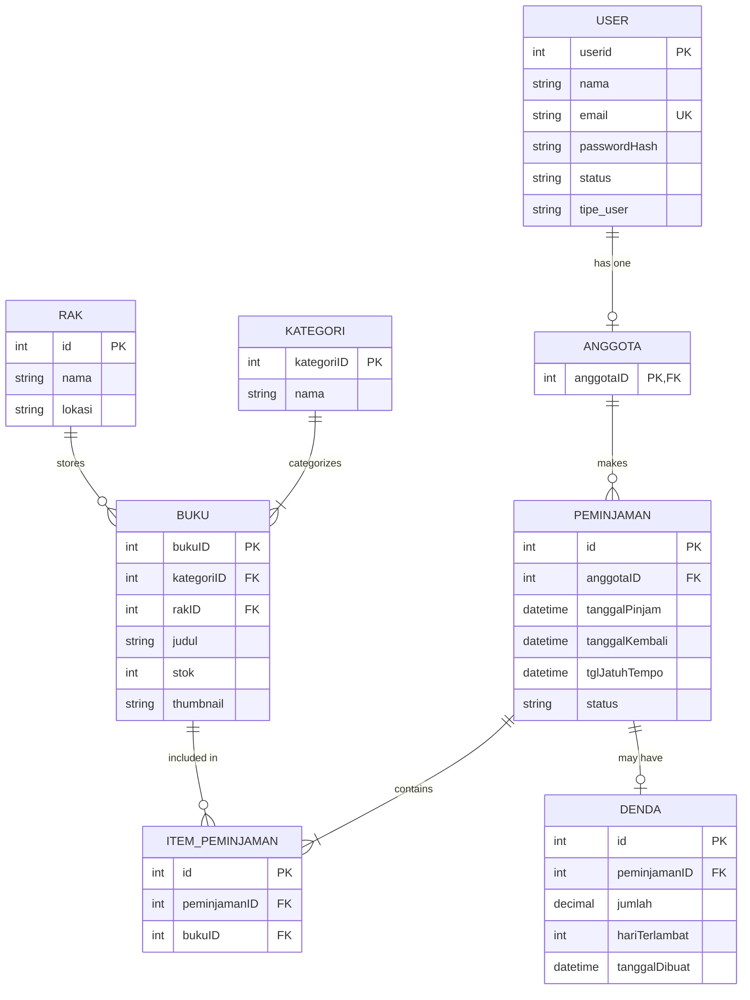
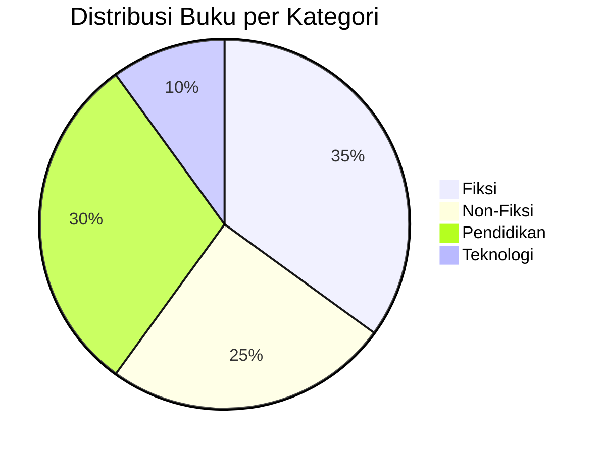

# 📚 Manual Book - Sistem digilibTBM (Digital Library TBM)

> **Versi**: 1.0  
> **Tanggal**: Januari 2026  
> **Framework**: Yii2 PHP Framework

---

## 📋 Daftar Isi

1. [Pendahuluan](#pendahuluan)
2. [Instalasi & Setup](#instalasi--setup)
3. [Fitur-Fitur Sistem](#fitur-fitur-sistem)
4. [Panduan Pengguna Admin](#panduan-pengguna-admin)
5. [Panduan Pengguna Member/Anggota](#panduan-pengguna-memberanggota)
6. [Troubleshooting](#troubleshooting)
7. [FAQ](#faq)

---

## 📖 Pendahuluan

### Tentang digilibTBM

**digilibTBM** (Digital Library Taman Bacaan Masyarakat) adalah sebuah sistem manajemen perpustakaan digital yang dirancang untuk memudahkan pengelolaan koleksi buku, anggota, dan transaksi peminjaman buku secara online.

### Fitur Utama

- ✅ **Manajemen Buku**: Tambah, edit, hapus, dan cari buku
- ✅ **Katalog Digital**: Pencarian buku berdasarkan judul, penulis, dan ISBN
- ✅ **Peminjaman Online**: Anggota dapat meminjam buku secara mandiri
- ✅ **Pengembalian Mandiri**: Anggota dapat mengembalikan buku secara online
- ✅ **Sistem Denda**: Perhitungan denda otomatis untuk keterlambatan
- ✅ **Multi-User**: Sistem role-based access (Admin & Member)
- ✅ **Dashboard Interaktif**: Visualisasi data dan statistik real-time

### Role Pengguna

| Role | Akses | Fungsi Utama |
|------|-------|--------------|
| **Admin** | Penuh | Kelola buku, anggota, peminjaman, kategori, rak |
| **Member/Anggota** | Terbatas | Browse katalog, pinjam buku, kembalikan buku, lihat riwayat |

---

## 🛠️ Instalasi & Setup

### Persyaratan Sistem

- PHP 7.4 atau lebih tinggi
- MySQL/MariaDB
- Composer (untuk dependency management)
- Web server (Apache/Nginx) atau PHP Built-in Server

### Langkah-Langkah Instalasi

#### 1. Clone/Download Project

```bash
cd d:\PROJEKTBM\digilibTBM
```

#### 2. Install Dependencies

```bash
composer install
```

#### 3. Setup Database

**Opsi A: Menggunakan phpMyAdmin**

1. Buka phpMyAdmin
2. Buat database baru bernama `db_digilib_tbm`
3. Import file SQL:
   - Buka file [`SQL_UNTUK_PHPMYADMIN.sql`](file:///d:/PROJEKTBM/digilibTBM/SQL_UNTUK_PHPMYADMIN.sql)
   - Copy seluruh isi file
   - Paste ke tab SQL di phpMyAdmin
   - Klik "Go" untuk eksekusi

**Opsi B: Menggunakan Script Otomatis**

Jalankan file batch yang sudah disediakan:

```bash
.\RUN_CREATE_DATABASE.bat
```

Script ini akan otomatis membuat database dan tabel-tabel yang diperlukan.

> 📌 **Dokumentasi lengkap setup database**: [DATABASE_SETUP.md](file:///d:/PROJEKTBM/digilibTBM/DATABASE_SETUP.md)

#### 4. Konfigurasi Database

Edit file [`config/db.php`](file:///d:/PROJEKTBM/digilibTBM/config/db.php):

```php
return [
    'class' => 'yii\db\Connection',
    'dsn' => 'mysql:host=localhost;dbname=db_digilib_tbm',
    'username' => 'root',  // Sesuaikan dengan username MySQL Anda
    'password' => '',      // Sesuaikan dengan password MySQL Anda
    'charset' => 'utf8mb4',
];
```

#### 5. Jalankan Server

Gunakan batch file yang sudah disediakan:

```bash
.\START_SERVER.bat
```

Atau jalankan manual dengan PHP built-in server:

```bash
php yii serve --port=8080
```

#### 6. Akses Aplikasi

Buka browser dan akses:

```
http://localhost:8080
```

### Akun Default

Setelah setup database, sistem akan membuat akun admin default:

| Field | Value |
|-------|-------|
| **Email** | admin@digilib.com |
| **Password** | 12345 |
| **Role** | Admin |

> ⚠️ **PERINGATAN**: Segera ubah password default setelah login pertama kali!

---

## 🎯 Fitur-Fitur Sistem

### Struktur Database

Sistem menggunakan 8 tabel utama:



### Kategori Buku Default

Sistem dilengkapi dengan 4 kategori default:

1. **Fiksi** - Novel, cerita pendek, dll
2. **Non-Fiksi** - Biografi, sejarah, dll
3. **Pendidikan** - Buku pelajaran, tutorial, dll
4. **Teknologi** - Programming, IT, dll

### Status Peminjaman

| Status | Deskripsi |
|--------|-----------|
| `menunggu_verifikasi_admin` | Peminjaman baru menunggu approval admin |
| `dipinjam` | Buku sedang dipinjam (sudah diverifikasi) |
| `dikembalikan` | Buku sudah dikembalikan |

---

## 👨‍💼 Panduan Pengguna Admin

### Login sebagai Admin

1. Buka halaman utama aplikasi
2. Klik tombol **"Login"**
3. Masukkan kredensial admin:
   - Email: `admin@digilib.com`
   - Password: `12345`
4. Klik **"Login"**
5. Anda akan diarahkan ke **Dashboard Admin**

### Dashboard Admin

Dashboard admin menampilkan:

- 📊 **Statistik Real-time**:
  - Total Buku
  - Total Anggota
  - Peminjaman Aktif
  - Buku Terlambat
  - Denda Belum Dibayar
  
- 📈 **Grafik Visualisasi**:
  - Distribusi kategori buku
  - Trend peminjaman bulanan
  - Top 5 buku terpopuler
  
- 🔔 **Notifikasi**:
  - Peminjaman menunggu verifikasi
  - Buku akan jatuh tempo
  - Stok buku menipis

### Manajemen Buku

#### Lihat Daftar Buku

1. Dari dashboard, klik menu **"Buku"**
2. Anda akan melihat tabel berisi semua buku dengan kolom:
   - Judul Buku
   - Kategori
   - Rak
   - Stok
   - Thumbnail
   - Aksi

#### Tambah Buku Baru

1. Di halaman Buku, klik tombol **"+ Tambah Buku"**
2. Isi form dengan data buku:
   - **Judul**: Nama buku
   - **Kategori**: Pilih dari dropdown (Fiksi, Non-Fiksi, dll)
   - **Rak**: Pilih lokasi penyimpanan
   - **Stok**: Jumlah eksemplar yang tersedia
   - **Thumbnail**: (Opsional) URL gambar cover buku
3. Klik **"Simpan"**
4. Sistem akan menampilkan pesan sukses

#### Edit Buku

1. Di daftar buku, klik ikon **pensil (✏️)** pada buku yang ingin diedit
2. Ubah data yang diperlukan
3. Klik **"Update"**

#### Hapus Buku

1. Di daftar buku, klik ikon **tempat sampah (🗑️)**
2. Konfirmasi penghapusan
3. Buku akan dihapus dari database

> ⚠️ **Perhatian**: Buku yang sedang dipinjam tidak bisa dihapus!

#### Cari Buku

Fitur pencarian mendukung:
- **Judul** buku
- **Penulis** (jika kolom tersedia)
- **ISBN** (jika kolom tersedia)

Cukup ketik kata kunci di search box dan tekan Enter.

### Manajemen Anggota

#### Lihat Daftar Anggota

1. Dari dashboard, klik menu **"Anggota"**
2. Tabel akan menampilkan:
   - Nama Anggota
   - Email
   - Status (Aktif/Nonaktif)
   - Jumlah Peminjaman Aktif
   - Aksi

#### Tambah Anggota Baru

1. Klik tombol **"+ Tambah Anggota"**
2. Isi form registrasi:
   - **Nama Lengkap**
   - **Email** (harus unik)
   - **Password**
   - **Status**: Aktif/Nonaktif
3. Klik **"Daftar"**

#### Edit Data Anggota

1. Klik ikon **pensil (✏️)** pada anggota yang ingin diedit
2. Update informasi yang diperlukan
3. Klik **"Update"**

#### Hapus Anggota

1. Klik ikon **tempat sampah (🗑️)**
2. Konfirmasi penghapusan
3. Anggota dan semua data terkait akan dihapus

> ⚠️ **Cascade Delete**: Menghapus anggota akan menghapus semua riwayat peminjaman mereka!

#### Lihat Detail Anggota

1. Klik nama anggota atau ikon **mata (👁️)**
2. Halaman detail menampilkan:
   - Informasi pribadi
   - Riwayat peminjaman
   - Denda yang belum dibayar

### Manajemen Peminjaman

#### Lihat Daftar Peminjaman

Menu **"Peminjaman"** menampilkan 4 tab:

1. **Tab Menunggu Verifikasi** 🔔
   - Peminjaman baru yang belum disetujui
   - Badge notifikasi menunjukkan jumlah
   
2. **Tab Aktif** 📖
   - Peminjaman yang sedang berjalan
   - Status: `dipinjam`
   
3. **Tab Terlambat** ⚠️
   - Peminjaman yang melewati jatuh tempo
   - Otomatis menghitung denda
   
4. **Tab Riwayat** 📚
   - Semua peminjaman yang sudah dikembalikan

#### Verifikasi Peminjaman Baru

Ketika anggota meminjam buku online:

1. Buka tab **"Menunggu Verifikasi"**
2. Review detail peminjaman:
   - Nama peminjam
   - Buku yang dipinjam
   - Tanggal pengajuan
3. Klik tombol **"Verifikasi & Aktifkan"**
4. Sistem akan:
   - Mengubah status menjadi `dipinjam`
   - Mengurangi stok buku
   - Mengirim notifikasi ke anggota

> 💡 **Tips**: Verifikasi peminjaman setelah anggota mengambil buku secara fisik di perpustakaan.

#### Pengembalian Buku (Manual oleh Admin)

1. Cari peminjaman di tab **"Aktif"**
2. Klik tombol **"Kembalikan Buku"**
3. Sistem akan:
   - Mengisi tanggal pengembalian
   - Menghitung denda (jika terlambat)
   - Menambah stok buku kembali
4. Jika ada denda, catat pembayaran tunai

#### Lihat Detail Peminjaman

Klik pada record peminjaman untuk melihat:
- Informasi anggota
- Daftar buku yang dipinjam
- Timeline:
  - Tanggal pinjam
  - Tanggal jatuh tempo
  - Tanggal kembali (jika sudah)
- Denda (jika ada)

### Manajemen Kategori

#### Tambah Kategori Baru

1. Klik menu **"Kategori"**
2. Klik **"+ Tambah Kategori"**
3. Masukkan nama kategori (contoh: "Komik", "Majalah")
4. Klik **"Simpan"**

#### Edit/Hapus Kategori

Sama seperti manajemen buku, gunakan ikon edit dan delete.

> ⚠️ **Perhatian**: Kategori yang memiliki buku tidak bisa dihapus!

### Manajemen Rak

#### Tambah Rak Baru

1. Klik menu **"Rak"**
2. Klik **"+ Tambah Rak"**
3. Isi form:
   - **Nama Rak**: Contoh "Rak A", "Rak B"
   - **Lokasi**: Contoh "Lantai 1", "Ruang Baca"
4. Klik **"Simpan"**

#### Edit/Hapus Rak

Gunakan ikon edit dan delete seperti fitur lainnya.

### Laporan & Statistik

Dashboard admin menyediakan:

#### Grafik Distribusi Buku per Kategori



#### Grafik Peminjaman Bulanan

Visualisasi trend peminjaman dalam 12 bulan terakhir.

#### Top 5 Buku Terpopuler

Ranking buku berdasarkan jumlah peminjaman.

---

## 👤 Panduan Pengguna Member/Anggota

### Registrasi Akun

1. Di halaman utama, klik **"Daftar"** atau **"Register"**
2. Isi form registrasi:
   - **Nama Lengkap**
   - **Email** (gunakan email valid)
   - **Password** (minimal 6 karakter)
   - **Konfirmasi Password**
3. Klik **"Daftar"**
4. Sistem akan membuat akun dengan role **"anggota"**
5. Login dengan kredensial yang baru dibuat

### Login sebagai Member

1. Klik **"Login"**
2. Masukkan email dan password
3. Klik **"Login"**
4. Anda akan diarahkan ke **Dashboard Anggota**

### Dashboard Anggota

Dashboard anggota menampilkan:

- 📊 **Ringkasan Peminjaman**:
  - Jumlah buku yang sedang dipinjam
  - Buku yang akan jatuh tempo
  - Total denda yang belum dibayar
  
- 📚 **Katalog Digital**:
  - Grid buku dengan thumbnail
  - Tombol aksi cepat "Pinjam Sekarang"
  
- 📖 **Riwayat Peminjaman Saya**:
  - Peminjaman aktif
  - Riwayat peminjaman sebelumnya

### Browse Katalog Buku

#### Cara Melihat Katalog

1. Dari dashboard, scroll ke bagian **"Katalog Digital"**
2. Atau klik menu **"Katalog"** di navigation bar
3. Buku ditampilkan dalam bentuk grid card dengan:
   - Thumbnail/cover buku
   - Judul
   - Kategori
   - Stok tersedia
   - Tombol **"Pinjam"**

#### Cari Buku

Gunakan search box untuk mencari berdasarkan:
- Judul buku
- Penulis
- ISBN

#### Filter Buku

Filter buku berdasarkan:
- **Kategori**: Fiksi, Non-Fiksi, Pendidikan, Teknologi
- **Ketersediaan**: Hanya tampilkan buku yang tersedia

### Meminjam Buku Online

#### Cara Pinjam Buku

1. Browse katalog dan temukan buku yang diinginkan
2. Klik tombol **"Pinjam Sekarang"** pada card buku
3. Sistem akan:
   - Memverifikasi stok tersedia
   - Membuat record peminjaman baru
   - Status: `menunggu_verifikasi_admin`
4. Anda akan melihat pesan konfirmasi

> 📌 **Catatan**: Peminjaman Anda menunggu verifikasi admin. Ambil buku di perpustakaan setelah mendapat konfirmasi.

#### Apa yang Terjadi Setelah Pinjam?

1. Peminjaman Anda masuk antrian verifikasi admin
2. Admin akan memverifikasi saat Anda datang mengambil buku
3. Setelah diverifikasi:
   - Status berubah menjadi `dipinjam`
   - Tanggal jatuh tempo dihitung (biasanya 7-14 hari)
   - Stok buku berkurang

#### Ketentuan Peminjaman

- ⏰ **Durasi Peminjaman**: 14 hari (bisa berbeda per perpustakaan)
- 📚 **Maksimal Pinjam**: Cek kebijakan perpustakaan
- 💰 **Denda Keterlambatan**: Rp 1.000/hari per buku (bisa berbeda)

### Lihat Peminjaman Aktif

1. Klik menu **"Peminjaman Saya"**
2. Tab **"Sedang Dipinjam"** menampilkan:
   - Buku yang sedang Anda pinjam
   - Tanggal pinjam
   - Tanggal jatuh tempo
   - **Countdown** hari tersisa
   - Tombol **"Kembalikan"**

### Pengembalian Buku Mandiri

Fitur ini memungkinkan Anda menandai pengembalian secara online.

#### Cara Mengembalikan Buku

1. Di halaman **"Peminjaman Saya"**, tab **"Sedang Dipinjam"**
2. Klik tombol **"Kembalikan Buku"** pada buku yang ingin dikembalikan
3. Sistem akan:
   - Mengisi tanggal pengembalian dengan hari ini
   - Menghitung denda jika terlambat
   - Mengubah status menjadi `dikembalikan`
4. Jika ada denda, sistem menampilkan peringatan:

> ⚠️ **Denda harus dibayar tunai di tempat!**  
> Jumlah Denda: Rp 5.000 (5 hari terlambat × Rp 1.000)

5. Kembalikan buku fisik ke perpustakaan dan bayar denda (jika ada)

#### Perhitungan Denda

Denda dihitung otomatis dengan rumus:

```
Denda = (Tanggal Kembali - Tanggal Jatuh Tempo) × Tarif per Hari
```

Contoh:
- Jatuh Tempo: 1 Januari 2026
- Tanggal Kembali: 6 Januari 2026
- Keterlambatan: 5 hari
- Tarif: Rp 1.000/hari
- **Total Denda: Rp 5.000**

### Lihat Riwayat Peminjaman

1. Klik menu **"Peminjaman Saya"**
2. Tab **"Riwayat"** menampilkan semua peminjaman yang sudah selesai:
   - Buku yang dipinjam
   - Tanggal pinjam & kembali
   - Denda (jika ada)
   - Status pembayaran

### Update Profil

1. Klik menu **"Profil"** atau ikon user di navbar
2. Anda dapat mengubah:
   - Nama
   - Email (pastikan unik)
   - Password
3. Klik **"Update Profil"**
4. Sistem akan menyimpan perubahan

---

## 🔧 Troubleshooting

### Error: "Connection Refused" saat Akses Aplikasi

**Penyebab**: Server tidak berjalan

**Solusi**:
1. Pastikan server sudah dijalankan:
   ```bash
   .\START_SERVER.bat
   ```
   atau
   ```bash
   php yii serve --port=8080
   ```
2. Cek apakah port 8080 sudah digunakan aplikasi lain
3. Coba port lain: `php yii serve --port=8081`

### Error: "Database Connection Failed"

**Penyebab**: Konfigurasi database salah atau MySQL tidak berjalan

**Solusi**:
1. Cek service MySQL/XAMPP sudah running
2. Verifikasi kredensial di [`config/db.php`](file:///d:/PROJEKTBM/digilibTBM/config/db.php)
3. Pastikan database `db_digilib_tbm` sudah dibuat
4. Test koneksi dengan command:
   ```bash
   php yii migrate
   ```

### Error: "Duplicate Entry for key 'email'"

**Penyebab**: Email sudah terdaftar di database

**Solusi**:
1. Gunakan email yang berbeda untuk registrasi
2. Atau hapus user lama dari database (admin only):
   ```sql
   DELETE FROM user WHERE email = 'email@example.com';
   ```

### Error: "Forbidden - You are not allowed to access this page"

**Penyebab**: Anda tidak punya akses ke halaman tersebut

**Solusi**:
1. Pastikan Anda login dengan role yang sesuai
2. Fitur tertentu hanya untuk admin
3. Logout dan login ulang jika masih error

### Buku Tidak Bisa Dipinjam

**Kemungkinan Penyebab**:
1. Stok habis (0)
2. Anda sudah punya peminjaman aktif yang belum dikembalikan
3. Akun belum diverifikasi admin

**Solusi**:
1. Cek stok buku di katalog
2. Kembalikan buku yang sudah dipinjam terlebih dahulu
3. Hubungi admin untuk verifikasi akun

### Denda Tidak Muncul

**Penyebab**: Perhitungan denda dilakukan saat pengembalian

**Solusi**:
- Denda otomatis dihitung saat Anda klik tombol **"Kembalikan Buku"**
- Jika tidak muncul, hubungi admin

### Lupa Password

**Solusi untuk Anggota**:
1. Hubungi admin perpustakaan
2. Admin dapat mereset password Anda dari halaman manajemen anggota

**Solusi untuk Admin**:
1. Akses database langsung via phpMyAdmin
2. Update password di tabel `user`:
   ```sql
   UPDATE user 
   SET passwordHash = '12345' 
   WHERE email = 'admin@digilib.com';
   ```
3. Login dengan password `12345`
4. Segera ganti password setelah login

### Thumbnail Buku Tidak Tampil

**Penyebab**: URL thumbnail tidak valid atau file tidak ada

**Solusi**:
1. Pastikan URL thumbnail valid (format: `http://...` atau `https://...`)
2. Atau upload gambar ke folder `web/uploads/` dan gunakan path relatif
3. Format yang didukung: JPG, PNG, GIF

---

## ❓ FAQ (Frequently Asked Questions)

### 1. Berapa lama durasi peminjaman buku?

**Jawab**: Default durasi peminjaman adalah **14 hari** kalender. Tanggal jatuh tempo dihitung otomatis saat admin memverifikasi peminjaman.

### 2. Apakah bisa memperpanjang peminjaman?

**Jawab**: Saat ini sistem belum support perpanjangan otomatis. Hubungi admin perpustakaan untuk request perpanjangan manual.

### 3. Bagaimana cara membayar denda?

**Jawab**: Denda dibayarkan **tunai di perpustakaan** saat mengembalikan buku fisik. Sistem hanya menghitung dan mencatat jumlah denda.

### 4. Apakah bisa meminjam lebih dari 1 buku sekaligus?

**Jawab**: Ya. Pinjam buku satu per satu melalui katalog. Semua peminjaman akan tercatat terpisah.

### 5. Kenapa peminjaman saya masih "Menunggu Verifikasi"?

**Jawab**: Peminjaman online perlu verifikasi admin. Datang ke perpustakaan untuk mengambil buku, lalu admin akan memverifikasi peminjaman Anda.

### 6. Bisa cancel peminjaman yang sudah di-request?

**Jawab**: Hubungi admin untuk membatalkan peminjaman yang masih dalam status "Menunggu Verifikasi".

### 7. Apakah data peminjaman tercatat selamanya?

**Jawab**: Ya. Semua riwayat peminjaman tersimpan di database untuk keperluan tracking dan laporan.

### 8. Bagaimana cara menambahkan kolom Penulis dan ISBN?

**Jawab**: Gunakan script yang sudah disediakan:

```bash
php add_penulis_isbn_columns.php
```

Script ini akan menambahkan kolom `penulis` dan `isbn` ke tabel `buku`.

### 9. Apakah sistem support multi-bahasa?

**Jawab**: Saat ini sistem hanya tersedia dalam Bahasa Indonesia. Untuk menambahkan bahasa lain, perlu modifikasi manual di view files.

### 10. Bagaimana cara backup database?

**Jawab**:

**Via phpMyAdmin**:
1. Buka phpMyAdmin
2. Pilih database `db_digilib_tbm`
3. Klik tab "Export"
4. Pilih format SQL
5. Klik "Go"

**Via Command Line**:
```bash
mysqldump -u root -p db_digilib_tbm > backup_digilib.sql
```

### 11. Bagaimana cara restore database?

**Jawab**:

**Via phpMyAdmin**:
1. Buat database baru `db_digilib_tbm`
2. Klik tab "Import"
3. Pilih file backup SQL
4. Klik "Go"

**Via Command Line**:
```bash
mysql -u root -p db_digilib_tbm < backup_digilib.sql
```

### 12. Apa yang terjadi jika anggota dihapus?

**Jawab**: Menghapus anggota akan **menghapus semua data terkait** (cascade delete):
- Semua record peminjaman
- Semua denda
- Akun user

> ⚠️ **Perhatian**: Backup database sebelum menghapus anggota!

### 13. Bagaimana cara mengubah tarif denda?

**Jawab**: Edit file [`controllers/AnggotaController.php`](file:///d:/PROJEKTBM/digilibTBM/controllers/AnggotaController.php) di method `actionPengembalianMandiri`, cari baris:

```php
$tarifDendaPerHari = 1000; // Ubah nilai ini
```

### 14. Apakah sistem ini gratis?

**Jawab**: Ya, sistem ini berbasis framework Yii2 yang open-source. Lisensi ada di file [`LICENSE.md`](file:///d:/PROJEKTBM/digilibTBM/LICENSE.md).

### 15. Bagaimana cara menghubungi support?

**Jawab**: Untuk dukungan teknis atau pertanyaan, hubungi administrator sistem Anda atau buat issue di repository proyek (jika menggunakan GitHub).

---

## 📞 Kontak & Support

### Informasi Kontak

- **Email Support**: [Isi dengan email support Anda]
- **Jam Operasional**: [Isi dengan jam operasional]
- **Alamat Perpustakaan**: [Isi dengan alamat]

### Sumber Daya Tambahan

- 📖 [README.md](file:///d:/PROJEKTBM/digilibTBM/README.md) - Dokumentasi teknis
- 🗄️ [DATABASE_SETUP.md](file:///d:/PROJEKTBM/digilibTBM/DATABASE_SETUP.md) - Panduan setup database
- 📷 [THUMBNAIL_UPDATE_DOCS.md](file:///d:/PROJEKTBM/digilibTBM/THUMBNAIL_UPDATE_DOCS.md) - Cara update thumbnail buku

### Framework Documentation

- [Yii2 Framework Guide](https://www.yiiframework.com/doc/guide/2.0/en)
- [Yii2 API Reference](https://www.yiiframework.com/doc/api/2.0)

---

## 📝 Changelog

### Versi 1.0 (Januari 2026)

**Fitur Baru**:
- ✅ Sistem peminjaman online
- ✅ Pengembalian mandiri
- ✅ Perhitungan denda otomatis
- ✅ Dashboard interaktif untuk admin dan member
- ✅ Katalog digital dengan thumbnail
- ✅ Pencarian buku (judul, penulis, ISBN)
- ✅ Multi-role user system (Admin & Member)
- ✅ Manajemen kategori dan rak

**Perbaikan**:
- 🔧 Fix error duplicate email pada registrasi
- 🔧 Fix login error "password atau email salah"
- 🔧 Perbaikan UI/UX dashboard

**Database**:
- 🗄️ Tambah tabel `item_peminjaman`
- 🗄️ Tambah kolom `thumbnail` pada tabel `buku`
- 🗄️ Support kolom `penulis` dan `isbn` (via script)

---

## 📄 Lisensi

Proyek ini dilisensikan di bawah [BSD 3-Clause License](file:///d:/PROJEKTBM/digilibTBM/LICENSE.md).

---

## 🎉 Selamat Menggunakan digilibTBM!

Terima kasih telah menggunakan sistem **digilibTBM**. Semoga manual book ini membantu Anda dalam menggunakan sistem perpustakaan digital ini dengan maksimal.

> **"Membaca adalah jendela dunia. Mari wujudkan perpustakaan digital yang modern dan efisien!"** 📚✨

---

**Dibuat dengan ❤️ menggunakan Yii2 Framework**
